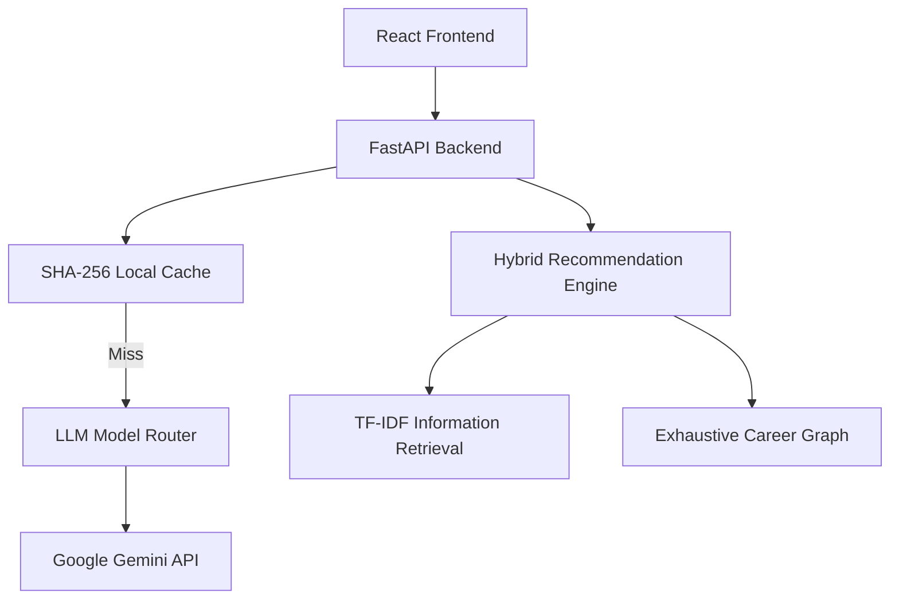
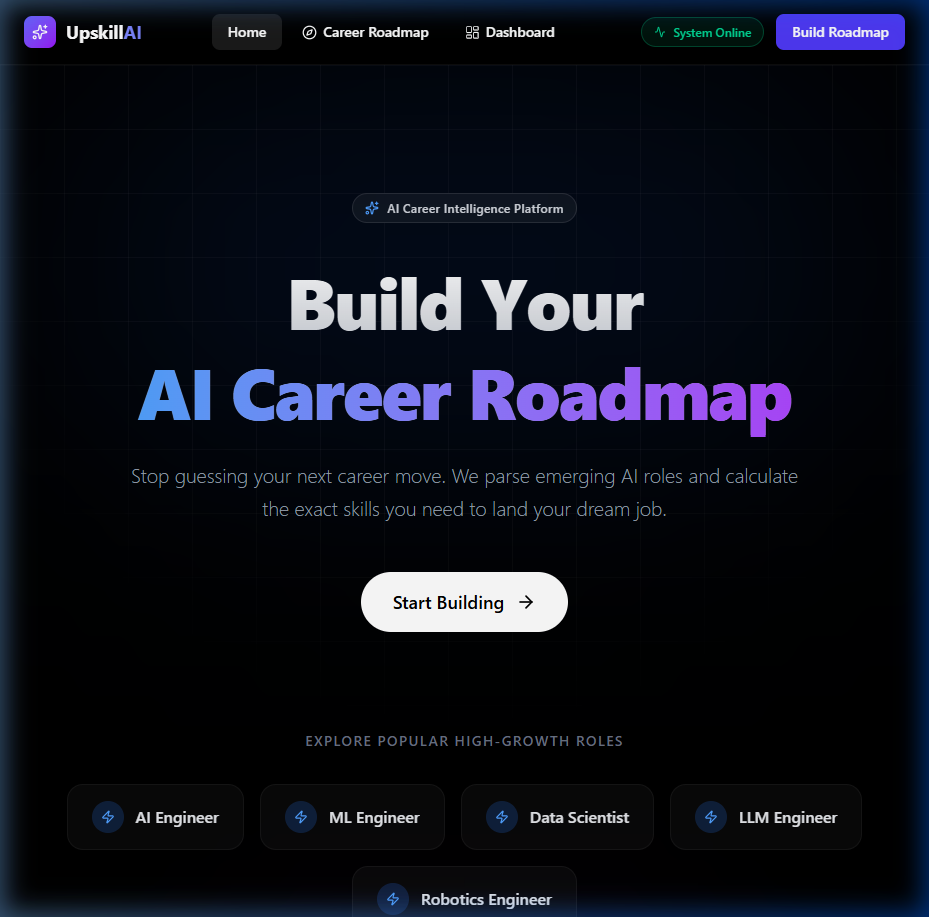
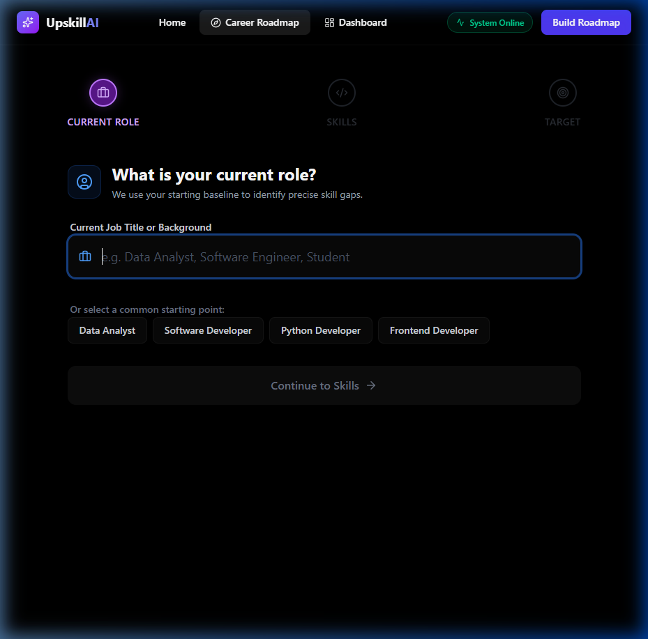
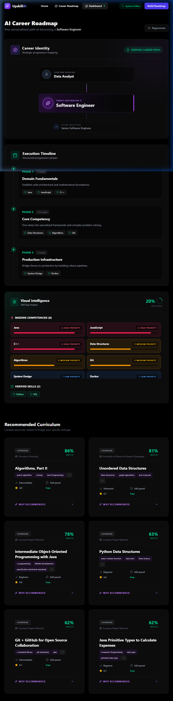

<div align="center">
  
  <h1>UpskillAI</h1>
  <p><strong>An Intelligent, Hybrid Career Transition & Learning Engine</strong></p>

  <p>
    <a href="https://github.com/altamashchougle/upskill-recommender/actions"></a>
    <a href="https://github.com/altamashchougle/upskill-recommender/blob/main/LICENSE"></a>
    <a href="https://www.python.org/downloads/"></a>
    
  </p>

  <p>
    <a href="#project-overview">Overview</a> •
    <a href="#features">Features</a> •
    <a href="#tech-stack">Tech Stack</a> •
    <a href="#system-architecture">Architecture</a> •
    <a href="#quick-start">Quick Start</a>
  </p>
</div>

---

## 🚀 Project Overview

UpskillAI solves a critical problem in the modern workforce: navigating career transitions without clear guidance on exactly *what* skills to learn and *where* to learn them. 

Designed for professionals looking to pivot or elevate their careers, this platform goes beyond standard keyword matching. It uses a **hybrid recommendation pipeline** to evaluate a user's current baseline against their target role's requirements, mathematically identifying skill gaps, and recommending the most efficient learning resources to bridge that divide.

**The Workflow:**
1. **Input:** Users define their current role, existing skills, and target career.
2. **Analysis:** The system resolves the roles against a strict internal taxonomy (dynamically invoking LLMs for unknown edge-case roles).
3. **Gap Detection:** It calculates the exact delta between possessed skills and required skills.
4. **Recommendation:** A content-based recommendation engine scores 7,000+ courses based on gap coverage.
5. **Enrichment:** Generative AI provides 1-sentence personalized explanations for why a specific course was chosen.

---

## ⚖️ Why Hybrid?

Traditional recommendation systems generally rely on either:
- **Deterministic recommendation algorithms** (like TF-IDF or Collaborative Filtering), which are highly reliable but lack nuanced human context and personalization.
- **Large Language Models (LLMs)**, which provide excellent personalized context but are prone to hallucinating non-existent courses or broken links.

UpskillAI combines both to maximize reliability and user experience:
- The **deterministic retrieval** phase mathematically guarantees that every recommended course actually exists in the catalog and objectively covers the user's skill gap.
- The **LLM enrichment** phase generates personalized explanations linking the course curriculum directly to the user's career transition goals.
- By separating retrieval from generation, **hallucinated recommendations are completely avoided**.

---

## ✨ Features

### Recommendation Engine
- **Content-Based Scoring:** Uses TF-IDF cosine similarity weighted by precise skill-gap overlap to rank courses objectively.
- **Dynamic Taxonomy:** Hardcoded domains map standard roles. Edge-case/niche roles trigger dynamic structural analysis to extract requirements on the fly.
- **Multi-Platform Corpus:** Pre-loaded with thousands of courses from Udemy and Coursera.

### AI Features
- **Explainable AI:** Rather than a black box, the LLM provides 1-sentence personalized justifications for each course recommendation based on the user's specific skill gap.
- **Fail-Safe Fallback:** If the LLM rate-limits or the API key is missing, recommendations remain available even when the Generative AI provider is unavailable by gracefully falling back to the deterministic retrieval engine.

### Backend & Frontend
- **High-Performance API:** Built on FastAPI for asynchronous, non-blocking request handling.
- **Modern React Interface:** A premium, responsive React dashboard built with TailwindCSS v4 and Framer Motion.
- **Data Persistence:** Global frontend state is synchronized with `localStorage` to preserve career roadmaps across sessions.

### Deployment & Observability
- **Stateless Architecture:** Fully decoupled client-server model ready for serverless or containerized deployment.
- **Local Caching:** Outgoing LLM requests are hashed (SHA-256) and cached to disk, dropping repeated query latency from ~4000ms to ~5ms.

---

## 💻 Tech Stack

| Domain | Technology | Description |
| :--- | :--- | :--- |
| **Languages** | Python 3.11, JavaScript (ES6+) | Core languages for backend and frontend. |
| **Frontend Framework** | React 18, Vite | High-performance client-side rendering. |
| **Frontend Styling** | TailwindCSS v4, Framer Motion | Premium utility-first styling and micro-animations. |
| **Backend Framework** | FastAPI, Uvicorn | Asynchronous Python REST API. |
| **Information Retrieval** | Scikit-Learn, Pandas | TF-IDF vectorization and cosine similarity calculations. |
| **Generative AI** | Google Gemini API | `gemini-2.5-flash`, `gemini-3.5-flash-lite` via `google-generativeai`. |
| **Testing** | Pytest, coverage | 200+ unit, integration, and adversarial LLM tests. |
| **CI/CD** | GitHub Actions | Automated build and coverage pipelines. |

---

## 🏗️ System Architecture



### Component Breakdown
- **Frontend:** A Vite-bundled React SPA utilizing a centralized `AppContext` for state. It sends REST requests to the backend.
- **Backend:** A FastAPI application that orchestrates the flow. It validates input via Pydantic schemas.
- **Recommendation Engine:** The core `RecommenderService`. It intersects the user's skill gap against a pre-loaded pandas DataFrame of 7,000 courses.
- **Gemini Integration:** Handled via a dynamic `ModelRouter` that selects the fastest available flash/lite model. 

---

## 🧠 Recommendation Pipeline

UpskillAI prioritizes explainability and deterministic correctness.

1. **Role Resolution:** The user's input is lowercased, stripped of seniority prefixes (e.g., "Senior", "Lead"), and checked against `ROLE_ALIASES`. 
2. **Skill Extraction:** The taxonomy maps the resolved role to a set of core domain skills.
3. **Gap Analysis:** Set logic determines: `Skill Gap = (Target Role Skills) - (User Possessed Skills + Current Role Baseline Skills)`.
4. **Similarity Search (TF-IDF):** 
   - A `TfidfVectorizer` converts the course catalog (titles, subjects) into a sparse matrix.
   - The user's specific skill gap is vectorized.
   - `cosine_similarity` determines the base relevance of all courses.
5. **AI Explanation:** The top N results are passed to Gemini with a highly constrained system prompt, returning lightweight JSON containing a 1-sentence "why".

---

## 🛠️ Engineering Highlights

UpskillAI demonstrates several production-oriented software engineering patterns:
- **Modular Service Layer:** Backend logic is cleanly separated into dedicated services (`recommender.py`, `gemini.py`, `model_router.py`), preventing bloated API route handlers.
- **FastAPI Dependency Injection:** Used for clean routing, query validation, and schema enforcement.
- **Local Cache Layer:** The `gemini_cache.py` implements a transparent caching layer utilizing SHA-256 hashing to eliminate redundant network calls.
- **Pydantic Validation:** Strict request and response schemas ensure robust API contracts and auto-generated OpenAPI documentation.
- **React Context:** `AppContext.jsx` provides global, synchronized state management tied directly to the browser's `localStorage`.

---

## 🤖 AI Integration

- **Gemini Usage:** Used strictly for taxonomy expansion of unknown roles and localized course explanations.
- **Prompt Engineering:** Prompts strictly enforce JSON output and character limits to prevent token bloat.
- **Rate Limiting & Error Handling:** The backend uses `try/except` blocks around all GenAI calls. HTTP 429s (Too Many Requests) immediately trigger the offline fallback.
- **Caching:** `app/cache/gemini_cache.py` intercepts prompts, hashes them, and checks the local `.cache/` folder before making network calls, saving massive overhead.

---

## 📂 Repository Structure

```text
backend/         # FastAPI server, ML logic, taxonomy, and Gemini integrations
frontend/        # React SPA, Vite configuration, and Tailwind styling
docs/            # Extended documentation and screenshots
tests/           # Exhaustive pytest suite (239 tests)
README.md        # Project documentation
requirements.txt # Python backend dependencies
```

---

## ⏱️ Quick Start

Get the application running locally in under a minute.

```bash
# 1. Clone the repository
git clone https://github.com/altamashchougle/upskill-recommender.git
cd upskill-recommender

# 2. Setup Backend
cd backend
pip install -r requirements.txt
export GEMINI_API_KEY="your_api_key_here"
python -m uvicorn main:app --reload --host 0.0.0.0 --port 8000 &

# 3. Setup Frontend (in a new terminal)
cd ../frontend
npm install
npm run dev
```
Visit `http://localhost:5173` in your browser.

---

## 📖 API Documentation

### `GET /recommendations`
Generates a ranked list of courses to bridge a career gap.
- **Query Params:** `job_role` (str), `goal` (str), `user_skills` (str, comma-separated), `use_ai` (bool).
- **Response:**
  ```json
  {
    "recommendations": [
      {
        "title": "Advanced Python Architecture",
        "provider": "Coursera",
        "skills_covered": ["Python", "System Design"],
        "ranking_explanation": "This course directly addresses your gap in System Design while building upon your Python foundation."
      }
    ],
    "skill_gap": ["System Design", "Docker", "Algorithms"],
    "metrics": { "coverage_score": 0.85 }
  }
  ```

### `GET /career_path/{job_role}`
Returns structured roadmap requirements for a specific role.

---

## 📸 Screenshots

| Landing Page | Career Roadmap Wizard |
| :---: | :---: |
|  |  |

| Interactive Dashboard |
| :---: |
|  |

---

## 🧪 Testing & Evaluation

The repository maintains an exhaustive 239-test suite.
```bash
cd backend
python -m pytest
```

### Evaluation Strategy
Recommendation quality and system reliability are evaluated through:
- **Role Resolution:** Unit tests verify that taxonomy lookups successfully resolve complex titles, aliases, and seniority prefixes.
- **Fallback Reliability:** `test_adversarial.py` throws broken JSON and hallucinated prompts at the Gemini parsers to ensure robust offline fallback behavior.
- **Skill Coverage & Offline Correctness:** Core recommendation logic is tested deterministically to ensure that the courses returned actually possess the required skills to bridge the defined gap, independent of LLM behavior.

---

## 📊 Performance

- **Startup Preprocessing:** Initial startup generation of the 7,000x1,500 sparse matrix takes ~0.8s on a standard CPU.
- **Recommendation Latency:** Offline TF-IDF recommendation retrieval takes ~45ms.
- **Cache Hit Latency:** LLM-enriched requests serving from local cache take ~50ms.
- **LLM Latency:** Cache misses depend entirely on the external Google API response times (typically ~2500ms - 4500ms).

---

## ⚠️ Limitations

- **Dataset Stagnation:** The 7,000 courses are loaded from static CSV files. In a true production environment, these would need to be updated periodically via cron jobs scraping the provider APIs.
- **Cold Start Taxonomy:** When a user requests an obscure role that misses the cache, the initial LLM parsing delay cannot be avoided.

---

## 🛣️ Roadmap

- [ ] **Migration to `google-genai`:** Update the legacy `google-generativeai` SDK to the modern Google GenAI SDK.
- [ ] **Auth Integration:** Implement JWT authentication to persist profiles across devices via PostgreSQL.
- [ ] **Live Provider APIs:** Swap static CSVs for live Coursera/Udemy affiliate APIs.
- [ ] **Dockerization:** Add `docker-compose.yml` for unified 1-click deployment.

---

## 🏆 Acknowledgements

- Built using the [Google Gemini API](https://ai.google.dev/).
- Course datasets provided via Kaggle (Coursera & Udemy Course Catalogs).
- UI icons powered by [Lucide React](https://lucide.dev/).
