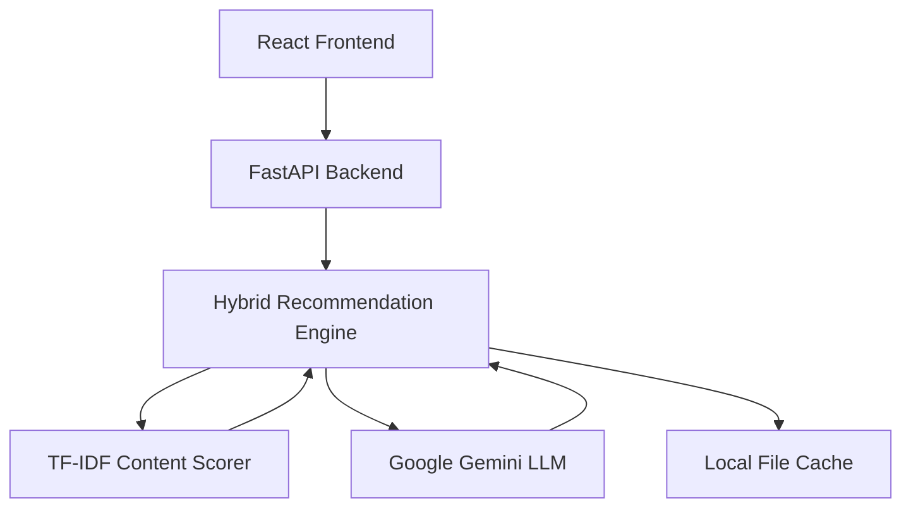

# UpskillAI Architecture

## System Overview
UpskillAI follows a decoupled client-server architecture designed for high performance, dynamic AI enrichment, and maintainability.

## Component Diagram

## Data Flow
1. User enters current role, target role, and skills in the Frontend wizard.
2. Frontend requests career path analysis from Backend.
3. Backend validates roles via strict taxonomy. If unknown, uses Gemini to parse and expand taxonomy.
4. Backend identifies skill gaps.
5. TF-IDF Engine scores 7,000+ local courses against the skill gap.
6. Gemini (if requested) enhances the top 10 results with tailored explanations.
7. Results are returned to Frontend and rendered in the Dashboard.
